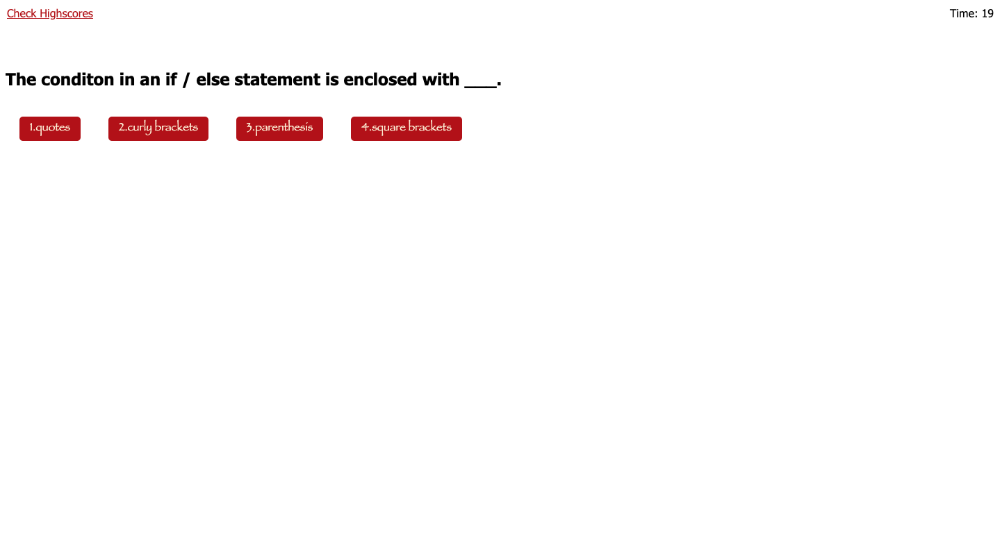

# Code-Quiz-

## Description

The [Code-Quiz](file:///Users/farhanhoque/Desktop/projects/Code-Quiz-/index.html) is an interactive quiz that covers the fundamentals of Javascript. Its presented with multiple choices along with promting in huge letters, if you are right or wrong and I also included a timer that can either be your best friend or your worst enemy. Feel free to try the quiz yourself. 

## Table of Contents 
- [Code-Quiz](#code-quiz)
- [Description](#description)
- [Table-of-Contents](#table-of-contents)
- [Objectives](#objectives)
- [Mock-Up](#mock-up)
- [Language](#languages)
- [Installation](#installation)
- [Deployed-Webpage](#deployed-webpage)
- [Credits](#credits)
- [License](#license)
- [Thank-You](#thank-you)

## Objectives 

```
AS A coding boot camp student
I WANT to take a timed quiz on JavaScript fundamentals that stores high scores
SO THAT I can gauge my progress compared to my peers
```

## Mock Up 



## Languages 

A list of languages that was used on this project: 
- HTML
- CSS
- JavaScript 

## Installation 

Created the repository on github first, used VS code as my programming application and from there i created multple files(html,css,highscore.js,script.js,question.js, and score.html) after i worked on all my files i made some comments for other developers to understand. Next i made commits and pushed it to github.

## Deployed Webpage 

click this [link](file:///Users/farhanhoque/Desktop/projects/Code-Quiz-/index.html) in order to deploy this application. 

## Credits 

I've created this website howver feel free to vist my [Github](https://github.com/fheezy) page to see any previous to recent projects i have worked on! 

## License 
MIT License

Copyright (c) 2022 fheezy

Permission is hereby granted, free of charge, to any person obtaining a copy
of this software and associated documentation files (the "Software"), to deal
in the Software without restriction, including without limitation the rights
to use, copy, modify, merge, publish, distribute, sublicense, and/or sell
copies of the Software, and to permit persons to whom the Software is
furnished to do so, subject to the following conditions:

The above copyright notice and this permission notice shall be included in all
copies or substantial portions of the Software.

THE SOFTWARE IS PROVIDED "AS IS", WITHOUT WARRANTY OF ANY KIND, EXPRESS OR
IMPLIED, INCLUDING BUT NOT LIMITED TO THE WARRANTIES OF MERCHANTABILITY,
FITNESS FOR A PARTICULAR PURPOSE AND NONINFRINGEMENT. IN NO EVENT SHALL THE
AUTHORS OR COPYRIGHT HOLDERS BE LIABLE FOR ANY CLAIM, DAMAGES OR OTHER
LIABILITY, WHETHER IN AN ACTION OF CONTRACT, TORT OR OTHERWISE, ARISING FROM,
OUT OF OR IN CONNECTION WITH THE SOFTWARE OR THE USE OR OTHER DEALINGS IN THE
SOFTWARE.

## Thank you

Thank you for visitng my page, hope you enjoyed it! 
